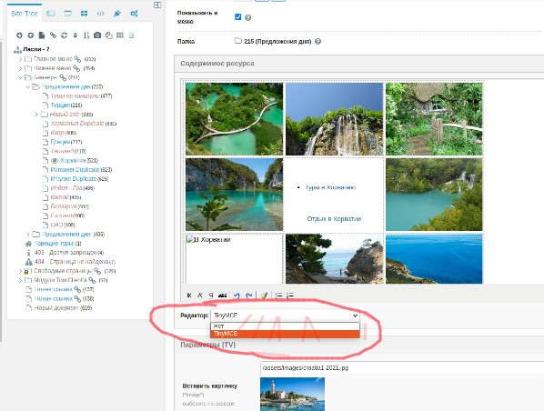
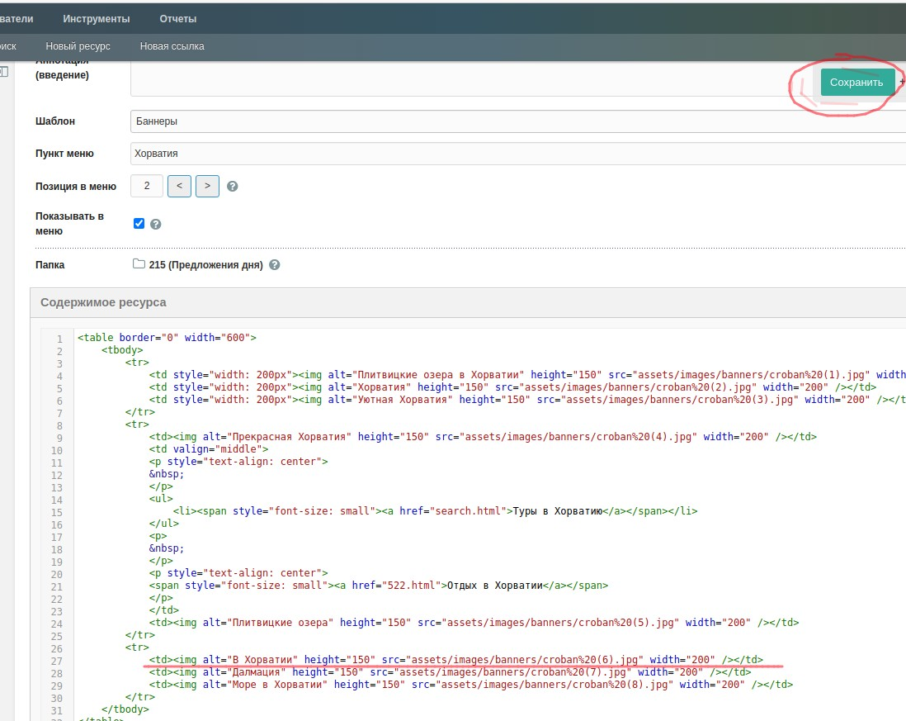

**Главная -> жмяк баннер со страной -> как поменять одну из картинок (на примере Хорватии)** 
   
_ШАГ 1 - узнаю название картинки, которую хочу заменить_  
- жмяк ПКМ на картинку -> жмяк `open image in new tab` -> название в title вкладки браузера. 
  
- Запоминаю название (в данном примере `croban (6)jpg`). 
  
_ШАГ 2 - удаляю картинку с этим названием_  
- Иду в раздел картинок этого раздела: жмяк `элементы -> управление файлами -> assets`  
  
- Там же в поддереве далее жмяк `images -> banners` (папка для картинок раздела 'баннеры'). 
Вижу полотно с названиями картинок, они сгруппированы по алфавиту и по странам в едином стиле во избежание бардака.  
- Нахожу строчку с нужным названием -> жмяк значок корзины. Подтверждаю.

_ШАГ 3 - загружаю новую картинку_  
- Внизу страницы - жмяк `choose file`  
- Выбираю в отркывшемся предварительно подготовленную картинку для загрузки. Пропорция 3 x 4 (150x200 px) для картинок раздела, но этот дизайн можно менять. Жмяк открыть, картинка сохраняется - внизу на страничке появляется "Файл успешно загружен" и сама картинка
- Проверяю в списке строчку с названием файла.  В данном случае загружал `croban (6).jpg`, а после загрузки вижу `croban-6.jpg`. Это автоматически произошло по некой причине (возможно, можно что-то подкрутить насчет небуквенных символов, чтобы такого не было, но это нужно дополнительно поискать). Поэтому иду к шагу 4, т.к. несоответствие этого нового названия и того старого, что в коде раздела - картинка пока не отображается на страничке баннера Хорватии

_ШАГ 4 - опциональный. Нужен, если название файла при загрузке немного поменялось_  
- Иду по дереву сайта -> баннеры -> предложения дня (их два - верх/низ, жмяк верхний, т.к. Хорватия сверху) -> Хорватия
  
- Середина страницы -> "содержимое ресурса", в котором оторбражается, собственно, уникальное содержимое странички баннера в привычном виде с картинками.  
  
- Меняю редактор с `TinyMCE` на "нет". Поменялся вид содержимого на его код в формате HTML.  
В этом коде в данном разделе 3 тэга `<tr>`, каждая из которых - строка с кодом картинок и текста. В данном примере меняю картинку слева снизу, поэтому она в третьей группе `<tr>`, ближе к низу. Вижу в ней 3 тега <td>, каждый это ячейка с картинкой. с атрибуте `src содержится ссылка на файл с картинкой`.  
  
Нахожу и меняю `croban%20(6).jpg` (`%20` - это код пробела) на `croban-6.jpg`. 
- Жмяк сверху зеленую кнопу "Сохранить".  

Готово.
